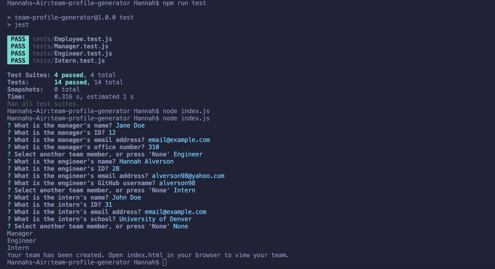
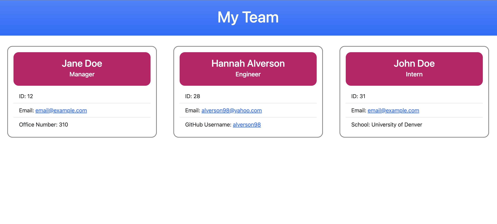

# Team Profile Generator: team-profile-generator
DU Boot Camp Module 10 - Object-Oriented Programming Challenge: Team Profile Generator

---

## Description

This application was created to practice newly learned skills such as creating unit tests, writing code that passes those tests, and making a Node.js command line application to render a new HTML file. The team profile generator gathers information for a Software Engineering Team to generate an HTML page that displays information of each team member. The purpose of this application is to provide a convenient way to organize and view information of an unlimited number of team members, all in one place.

### Requirements

A list of requirements derived from acceptance criteria and personal goals:

- Prompt user with questions using the Inquirer package.
- Render an HTML page that displays information based on user input.
- Emails include link to auto-populate default email app with the 'TO' field.
- GitHub profile link opens in new tab.
- Questions that ask for information specific to employee position, in addition to what type of employee the user would like to add.
- Creating unit tests and code that passes those tests to keep code maintainable.

### Skills Learned/ Improved

Here is a list of some skills I learned and/or improved throughout this project:

- Writing unit tests
- Prompting questions using Inquirer
- Organizing various files in multiple directories
- Using Node.js 
- Installing necessary packages
- Improving more familiar skills involving basic JavaScript, HTML, and CSS.

Tools used to complete this project:

- VS Code
- Terminal
- GitHub
- Bootstrap
- Inquirer
- Jest

## Usage

Team Profile Generator is for anyone who needs to organize information of their Software Engineering team and view it all in one location. This is specifically for teams that include a manger, engineers, and interns. The questions are asked and answered within the terminal, while the rendered HTML page can be viewed in your preferred browser. 

The following information is requested from the user...

All positions:
- Name
- Id number
- Email address

Manager:
- Office number

Engineer:
- GitHub username

Intern:
- School name

Here is the application's appearance when you run the tests and the questions to generate the HTML page:

Here is an example of the rendered HTML page:

### Links

[Link](https://drive.google.com/file/d/1piUQheV00juSuA4KBXn12JisL4wGG4gA/view) to walk through video.

[Link](https://github.com/alverson98/team-profile-generator) to code repository.

## Credits

I received guidance and tips from the instructional staff, TA's, and Students from the University of Denver Coding Boot Camp.

